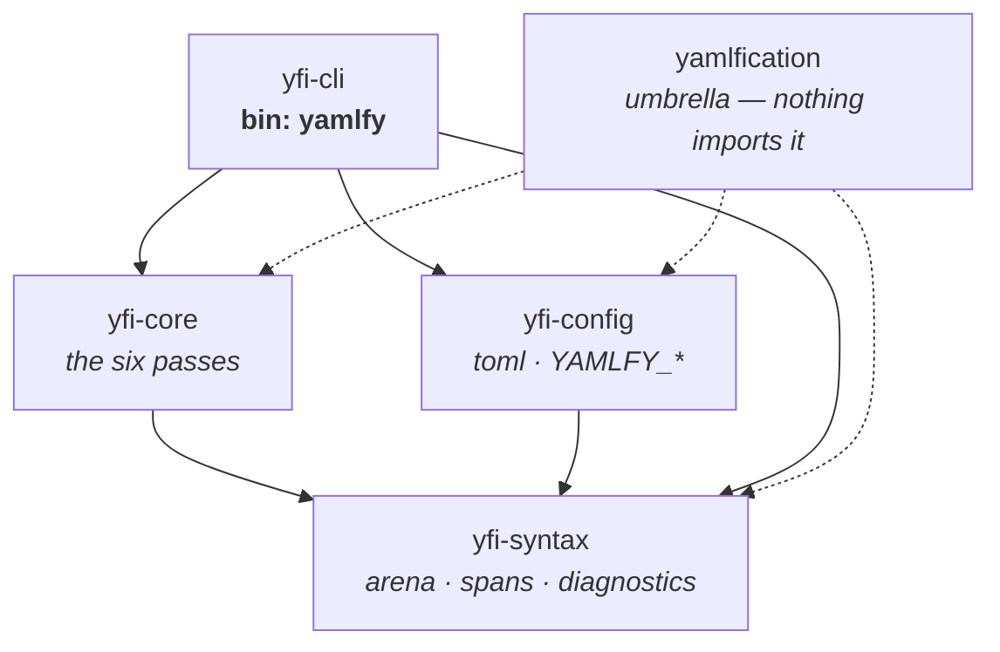
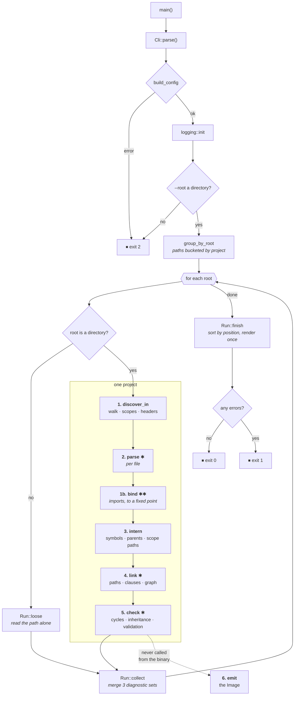

<!-- Written by Richard Christopher, Copyright 2026 NeoTec, LLC -->
<!-- SPDX-License-Identifier: GPL-3.0-or-later -->

# How a `yamlfy` run works

One command, traced end to end. `docs/semantics.md` says what the language *means*;
this says what the code *does*, in order.

## Crates

`yfi-syntax` is the sink — it depends on no other workspace crate and everything
depends on it. There are no back-edges between passes.

## The run

Four ways out, marked ⏹. Three places something runs **twice** — each is a real
decision, explained below.

## The three double-runs

**✱ `parse`, once or twice per file.** `discover` parses every file to read its
header — which is the only way to learn what it imports. A file that imports
something is then parsed *again* with those definitions installed, and only the
second arena is kept. Files importing nothing are parsed once. The survey parse's
diagnostics are **replaced**, not merged: it reports unknown anchors that the real
parse resolves.

**✱✱ `bind`, to a fixed point.** Mutually importing files have no imports-first
order, so their members are re-parsed until their exported name sets stop moving,
bounded by `members + 1` rounds. An acyclic chain converges in one.

**✱ `link`, resolving references twice.** Whether a `connections:` item is a *path*
or a *value* depends on whether some `!edge` reads that sequence — which is known
only from the inheritance relation, which is built from clauses, whose operands are
themselves paths. The circle is broken by resolving once silently with no endpoints
known (correct for every clause operand, since no operand is ever an endpoint),
deriving the endpoint set, then resolving again for real.

**✱ `check`, two diagnostic sets.** Findings that read a *resolved view* go into a
second collection, folded in only when the inheritance graph was acyclic. After a
cycle the resolved view is the compiler's own repair, so a diagnostic derived from it
would blame an edge nobody wrote. The views are still built — a caller may inspect a
cyclic project.

## Pass interfaces

| pass | entry | consumes | produces |
|---|---|---|---|
| 1 `discover` | `discover_in(sources, root, opts)` | a `SourceMap`, by value | `Project` |
| 2 `parse` | `parse_with_imports(sources, file, opts, imports)` | one file | `Parsed { ast, diagnostics }` |
| 3 `intern` | `intern(&project)` | `&Project` | `Interned` |
| 4 `link` | `link_with(&project, &interned, sev)` | the two above | `Linked` |
| 5 `check` | `check_with(&project, &interned, &linked, sev)` | the three above | `Checked` |
| 6 `emit` | `emit(&project, &interned, &linked, &checked)` | all four, borrowed | `Image<'a>` |

Data flows strictly forward. No pass mutates an earlier pass's output; each is a side
table keyed by `(FileId, NodeId)`. The one exception is `Ast::rebind_import`, the
only `&mut` on a finished arena, used solely to point an imported anchor at the node
it names once every file has been parsed.

## Where the shared kernel lives

`link::Ctx` is the most-called thing in the compiler — `Ctx::ast()` from 33 sites in
15 files — and it is used by passes 4, 5 and 6. It lives in `link.rs` for historical
reasons rather than good ones: pass 4 owns it, and the two passes after it borrow it.

## Pass 6 is not on the product path

`emit` is called from tests and from nothing else. The `check` subcommand stops after
pass 5, because every diagnostic is raised by then and the `Image` is what a *runtime*
would consume — and the runtime is deliberately a separate artifact. The image is a
library surface, complete and tested; it is simply not what `yamlfy check` is for.
